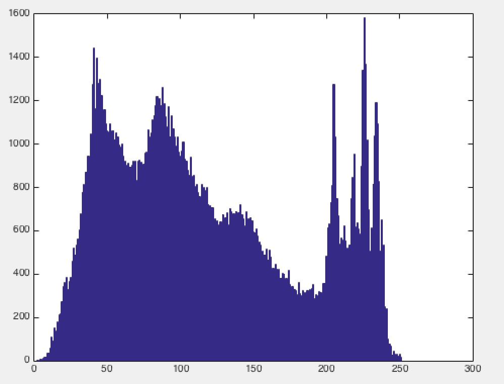
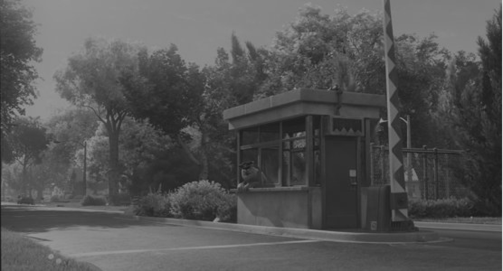
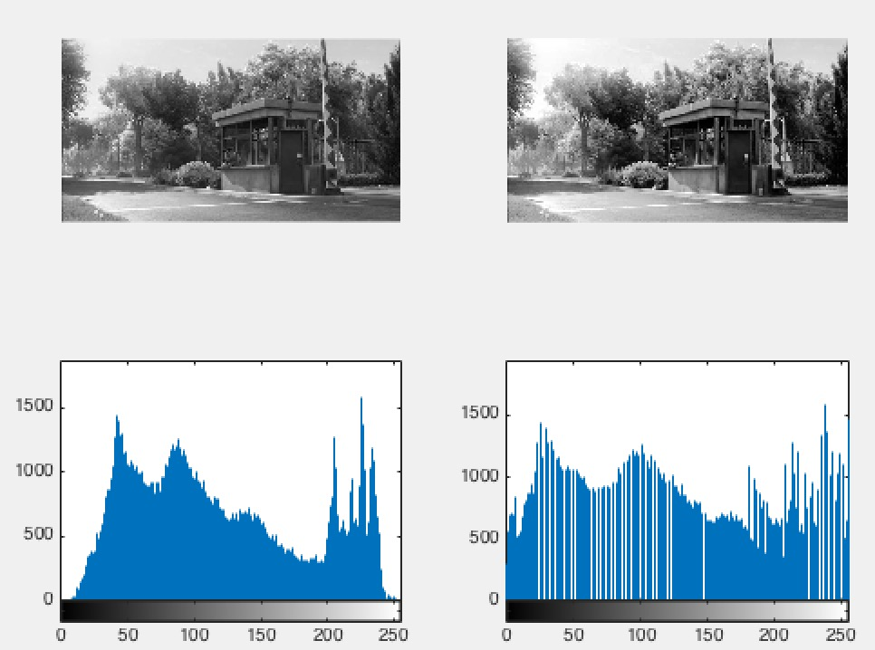

+ 给定一幅图像，输出其直方图。 

 	+ MyHist.m

	+ function MyHist(I) %I是输入图像，可以是灰度图像可以是彩色图像
	
	+ 示例结果：
	

+ 给定一个线性变换函数，实现图像的灰度拉伸。 

	+ linear_transform.m

	+ %输入I,a,b
	+ %I是灰度图像，线性函数是ax+b
	
	+ 示例结果
	

+ 实现对图像的均衡化。 

	+ MyHisteq.m

	+ %输入图像I
	
	+ 示例结果
	
	
+ 实验图像为

	+ 
	

+ 以上程序都通过nargin做了默认输入，可以直接运行查看结果