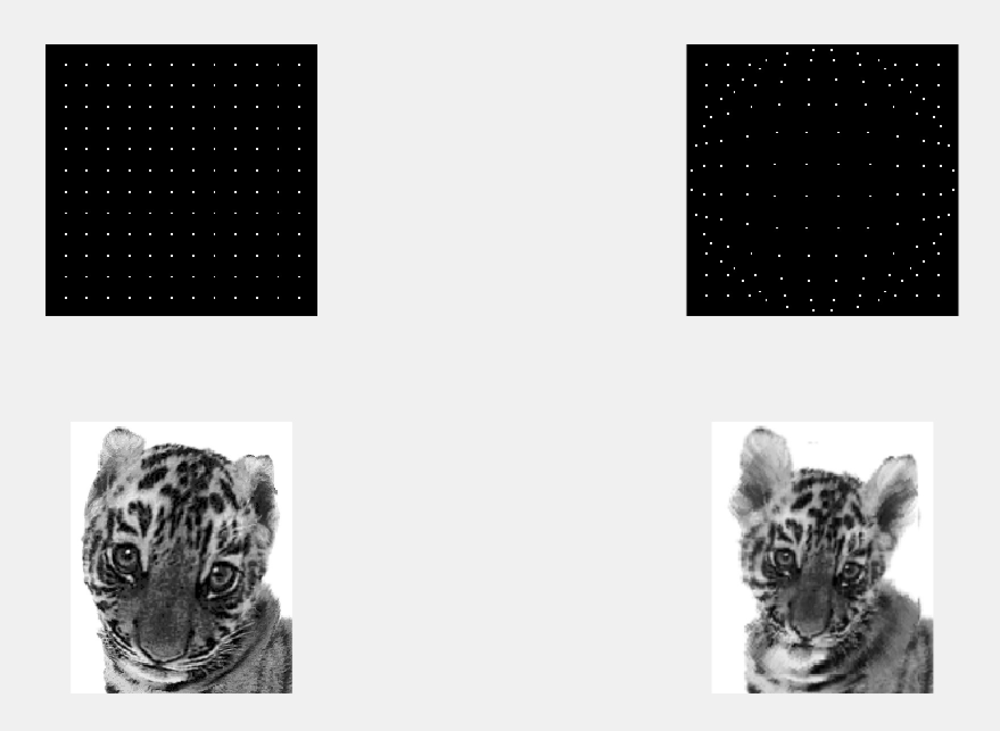

# Homework 2
### Requirement
+ 给定栅格图像及其变形后的栅格图像，请你首先确定各栅格交叉点的位移，然后采用控制栅格的方法编写实现图像几何校正的程序。
+ 实验图像：point.bmp, point_sp.bmp, tiger_sp.bmp

### Implementation
+ @copyright www.jingliu.me
+ im_calibration.m实现卷绕变换，输入是原图像、控制点向量（原）、控制点向量（变形后）、栅栏图像
+ MyImresize实现对图像的线性插值以及尺寸变换
+ 运行test.m即可查看结果
+ 实现中，边缘处没有哦加上控制点
+ 如果想要改变控制点，可以运行im_register，手动标记控制点，注意对对靶图像的标注必须按照相同的顺序用于对准。如果标记失误，可以将./img/下的备份的pos.mat和pre.mat拷贝到当前目录下执行。
+ 已经在OSX10.10.3+Matlab Unix 2014b 以及 windows7+Matlab 2015a上测试过
+ 运行截图为./img/result.jpg

