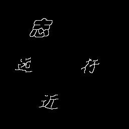

# Homework 4
### Requirement
+ 编制通用的二值形态学运算（腐蚀和膨胀、开、闭和击中击不中变换）函数，函数可以处理不同的变换形式和不同类型的结构元素。并用你编制的形态学函数对一个二值图像进行处理。 

+ 用形态学击中击不中变换方法对图像进行细化处理。 

+ 实验图像：二值图像由一段文字组成，word_bw.bmp

### Implementation
+ 运行test.me查看结果
+ 与matlab自带的函数进行了对比，得出的结果是一样的
+ 击中不击中变换的结果如下图

输入： 输出：

+ 细化结果如下图

